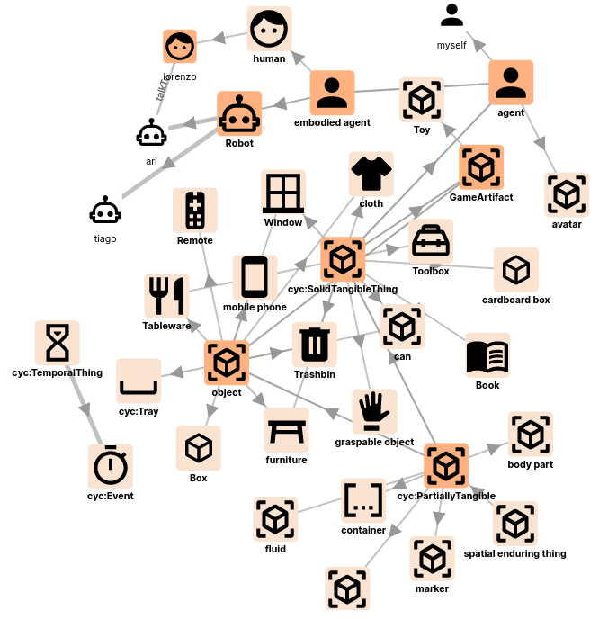

KnowledgeCore
==============




KnowledgeCore is a RDFlib-backed minimalistic knowledge base, initially designed
for robots (in particular human-robot interaction or multi-robot interaction).
It features full [ROS 2](https://www.ros.org) support.

It stores triples (like RDF/OWL triples), and provides an [API](doc/api.md)
accessible via three interfaces:
- **directly in Python** by instantiating the `KnowledgeCore` class;
- over **ROS 2** topics and services (the main supported interface);
- over a **TCP socket** protocol, compatible with the
  [pykb](https://github.com/severin-lemaignan/pykb) client library.

It integrates with the [reasonable](https://github.com/gtfierro/reasonable) OWL2
RL reasoner to provide OWL2 semantics and fast knowledge materialisation.

Example
-------

This example uses the ROS 2 API (see below), with some Pythonic syntactic sugar:

```python

from knowledge_core.api import KB
kb = KB()

def on_robot_entering_antonio_property(evt):
  print("A robot entered Antonio's %s: %s" % (evt[0]["place"], evt[0]["robot"]))

kb += "ari rdf:type Robot"  
kb += ["antonio looksAt ari", "ari isIn kitchen"]

kb.subscribe(["?robot isIn ?place", "?place belongsTo antonio", "?robot rdf:type Robot"], on_robot_entering_antonio_property)

kb += "kitchen belongsTo antonio"

# try as well:
# kb -= "antonio looksAt ari" to remove facts
# kb["* rdf:type Robot"] to query the knowledge base
```

will print:

```
A robot entered Antonio's kitchen: ari
```

You can also use the core `KnowledgeCore` class directly (without ROS):

```python
from knowledge_core.kb import KnowledgeCore
kb = KnowledgeCore()

kb += ["ari rdf:type Robot", "ari isIn kitchen"]
print(kb["* rdf:type Robot"])            # [{'var1': 'ari'}]
print("ari isIn kitchen" in kb)          # True
print(kb.classesof("ari"))              # ['Robot']
kb -= ["ari isIn kitchen"]
```

Installation
------------

**KnowledgeCore only supports Python 3**

### Prerequisite

`rdflib >= 6.0.0`:

```
$ pip install rdflib
```

For reasoning (optional):

```
$ pip install reasonable
```

If you want to use the ROS 2 interface, you also need to install the `kb_msgs`
package, available here: https://gitlab.iiia.csic.es/socialminds/neurosymbolic-ai/kb_msgs

Finally, you might want to install the [OpenRobots
Ontology](https://gitlab.iiia.csic.es/socialminds/neurosymbolic-ai/openrobots-ontology) as a
sample ontology to play with.


### Installation

From `pypi`:

```
$ pip3 install knowledge_core
```

or with `uv`:

```
$ uv pip install knowledge_core
```

From source:

```
$ git clone https://gitlab.iiia.csic.es/socialminds/neurosymbolic-ai/knowledge_core.git
$ cd knowledge_core
$ python3 setup.py install
$ knowledge_core
```

If using ROS 2, you can also use your regular colcon/ament workflow:

```
$ cd ~/ros2_ws/src
$ git clone https://gitlab.iiia.csic.es/socialminds/neurosymbolic-ai/knowledge_core.git
$ git clone https://gitlab.iiia.csic.es/socialminds/neurosymbolic-ai/kb_msgs.git
$ cd ~/ros2_ws
$ colcon build --packages-up-to knowledge_core
$ source install/setup.bash
```


Documentation
-------------

See the full [API documentation](doc/api.md) for details on each interface.

### General usage

You can use `KnowledgeCore` in three ways:

1. **Directly in Python** (embedded mode): instantiate `KnowledgeCore` and call
   methods directly. No server process needed, but limited to one client.

2. **Via ROS 2** (recommended for robotics): start the ROS 2 node, then use the
   `knowledge_core.api.KB` Pythonic wrapper or interact with topics/services
   directly.

3. **Via the TCP socket server**: start the `knowledge_core` process and connect
   using [pykb](https://github.com/severin-lemaignan/pykb) or any TCP client
   implementing the protocol.

### Direct Python usage (embedded mode)

```python
from knowledge_core.kb import KnowledgeCore

kb = KnowledgeCore()

kb += ["sky hasColor blue", "sky rdf:type Object"]
print(kb["* hasColor *"])       # [{'var1': 'sky', 'var2': 'blue'}]
print("sky hasColor blue" in kb) # True

kb.clear()
```

### ROS 2 usage

**This version of KnowledgeCore only supports ROS 2.**

**Please first read the general [API introduction](doc/api.md), as this applies
to the ROS 2 interface as well.**

To start the ROS 2 node:

```
ros2 launch knowledge_core knowledge_core.launch.py
```

**Note that, in general, you want to use the Pythonic wrapper
(`knowledge_core.api.KB`) built on top of the low-level ROS topics/services API.
See example above. This Pythonic interface follows the
[`pykb`](https://github.com/severin-lemaignan/pykb) API (except in a few corner
cases that are not supported by the ROS 2 interface).**

`knowledge_core` exposes two topics, `/kb/add_fact` and `/kb/remove_fact`, to
add/remove triples to the knowledge base. Both topics expect a simple string
with 3 tokens separated by spaces (if the object is a literal string, use double
quotes to escape it).

It also exposes the following services:

- `/kb/manage` to manage the knowledge base (including eg clearing all the
  facts, loading ontologies, saving the KB, and status checks)
- `/kb/revise` to add/remove/update facts using a synchronous interface
- `/kb/query` to perform simple queries
- `/kb/about` to return the list of all statements involving a specific concept
- `/kb/label` to return the label of a specific concept (or the concept name if no
  label is available)
- `/kb/details` to return details about one specific concept (for instance,
  parent classes, instances,...)
- `/kb/lookup` to return the list of terms matching the provided string, either
  in their name or in their label
- `/kb/sparql` to perform complex queries (full SPARQL endpoint)
- `/kb/events` to subscribe to 'events' by providing a (set of) partially-bound
  triples. Calling the service returns an event *id*. Subscribe then to the
  `/kb/events/<id>` topic to be notified each time a new instance/class matches the
  provided pattern

### Socket server usage

To start the knowledge base as a server:

```
$ knowledge_core
```

(run `knowledge_core --help` for available options)

Then, using [pykb](https://github.com/severin-lemaignan/pykb):

```python
import kb

with kb.KB() as kb:
    kb += ["sky hasColor blue"]
    print(kb["* hasColor *"])
```

### Interacting with KnowledgeCore from other languages

- from C++: check [liboro](https://github.com/severin-lemaignan/liboro) (note:
  this library is not actively maintained anymore)
- from any other language: the communication with the server relies on a simple
  socket-based text protocol. Feel free to get in touch if you need help to add
  support for your favourite language!


Visualisation
-------------


`KnowledgeCore` comes with its own interactive web-based visualisation tool, KB Explorer.
See [KB Explorer README](pages/README.md) for more information.

`KnowledgeCore` is also compatible with [oro-view](https://github.com/severin-lemaignan/oro-view).

Features
--------

### Server-Client or embedded

`KnowledgeCore` can be run as a stand-alone (socket) server, as a ROS 2 node,
or directly embedded in Python applications.

### Multi-models

`KnowledgeCore` is intended for dynamic environments, with possibly several
contexts/agents requiring separate knowledge models.

New models can be created at any time and each operation (like knowledge
addition/retraction/query) can operate on a specific subset of models.

Each model is independently classified by the reasoner.

### Event system

`KnowledgeCore` provides a mechanism to *subscribe* to some conditions (like: an
instance of a given type is added to the knowledge base, some statement becomes
true, etc.) and get notified back.

### Reasoning

`KnowledgeCore` provides RDFS/OWL reasoning capabilities via the
[reasonable](https://github.com/gtfierro/reasonable) reasoner.

See [reasonable README](https://github.com/gtfierro/reasonable#owl-2-rules) for
the exact level of support of the different OWL2 RL rules.

### Transient knowledge

`KnowledgeCore` allows to attach 'lifespans' to statements: after a given duration,
they are automatically collected.

### Ontology walking

`KnowledgeCore` exposes several methods to explore the different ontological models
of the knowledge base.

Testing
-------

`KnowledgeCore` has two test suites:

- `tests/test_base.py`: tests the core `KnowledgeCore` class directly (no ROS
  required). Run with: `python -m pytest tests/test_base.py`
- `tests/test_ros.py`, `tests/test_ros_events.py`,
  `tests/test_pythonic_api_ros.py`: test the ROS 2 interface via
  `launch_testing`. Run with: `colcon test --packages-select knowledge_core`
